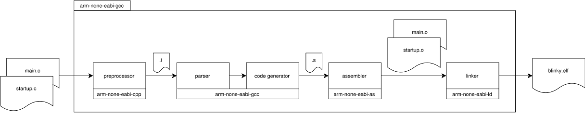

# Tutorials
## 1. Cross-compilation and Toolchains
***Cross compilation*** is a process in which cross-toolchain runs on the host machine and creates executables that run on different machine.  
***Toolchain*** or a ***Cross-compilation toolchain*** is a collection of binaries which allows you to compile, assemble, link and analize your applications.  
Meaning of binaries from **GNU Tools (GCC)** for ARM processors which can be downloaded from official ARM site ([ARM Developer](https://developer.arm.com/downloads/-/gnu-rm)):  
- **m-none-eabi-gcc**: The GNU C compiler for ARM.
- **arm-none-eabi-gcc-10.3.1**: A specific version of the GNU C compiler for ARM.
- **arm-none-eabi-as**: The GNU assembler for ARM.
- **arm-none-eabi-ld**: The GNU linker for ARM.
- **arm-none-eabi-c++**: The GNU C++ compiler for ARM
- **arm-none-eabi-g++**: Another name for the GNU C++ compiler for ARM.
- **arm-none-eabi-ar**: A utility for creating, modifying, and extracting from archives.
- **arm-none-eabi-cpp**: The C preprocessor for ARM.
- **arm-none-eabi-nm**: Lists symbols from object files.
- **arm-none-eabi-gdb**: The GNU Debugger for ARM, used to debug programs.
- **arm-none-eabi-objcopy**: Copies and translates object files.
- **arm-none-eabi-objdump**: Displays information from object files.
- **arm-none-eabi-ranlib**: Generates index to archive.
- **arm-none-eabi-readelf**: Displays information about ELF files.
- **arm-none-eabi-size**: Lists section sizes and total size.
- **arm-none-eabi-gcc-ar**: A version of ar that works with GCC.
- **arm-none-eabi-gcc-nm**: A version of nm that works with GCC.
- **arm-none-eabi-gcc-ranlib**: A version of ranlib that works with GCC.
- **arm-none-eabi-gcov:** Coverage testing tool.
- **arm-none-eabi-gcov-dump**: Dumps coverage information.
- **arm-none-eabi-gcov-tool**: Merges coverage data files.
- **arm-none-eabi-strings**: Lists printable strings from files.
- **arm-none-eabi-strip**: Discards symbols from object files.
- **arm-none-eabi-elfedit**: A tool to update ELF headers.
- **arm-none-eabi-gprof**: A performance analysis tool for profiling applications.
- **arm-none-eabi-ld.bfd**: The BFD (Binary File Descriptor) linker for ARM.
- **arm-none-eabi-lto-dump**: A tool to dump LTO (Link Time Optimization) information.
- **arm-none-eabi-addr2line**: Converts addresses into file names and line numbers, useful for debugging.
- **arm-none-eabi-c++filt**: Demangles C++ and Java symbols.
- **arm-none-eabi-gdb-add-index**: Adds an index to GDB for faster symbol lookup.
- **arm-none-eabi-gdb-add-index-py**: Python script for adding an index to GDB.
- **arm-none-eabi-gdb-py**: Python-enabled version of GDB.

## 2. Build-process
In the picture below, the entire compilation and linking process is shown, which can be completed with **arm-none-eabi-gcc**. This tool can perform all the steps mentioned above, or they can be done separately using the individual binaries (**arm-none-eabi-cpp**, **arm-none-eabi-gcc**, **arm-none-eabi-as**, **arm-none-eabi-ld**), as illustrated below in the separate processes.

